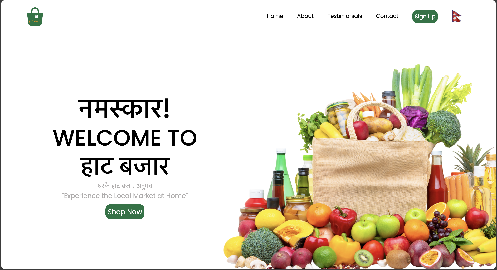

# Grocery App

A full-stack grocery application designed to make shopping convenient for users in Nepal. This project currently focuses on the front-end development, and the backend database will be added in future updates.

## Landing Page


## Tech Stack
- **Frontend**: React
- **Backend**: Express and Node.js
- **Database**: MongoDB (to be added in future development)

<!-- ## Project Structure
```
/grocery-app
├── public             # Static files (e.g., images, icons)
├── src
│   ├── components     # Reusable components (e.g., ProductList, Cart)
│   ├── pages          # Page components (e.g., Home, ProductDetail)
│   ├── services       # API request functions (using Axios or Fetch)
│   └── App.js         # Main React component
├── server             # Backend server files (Express and Node.js)
│   ├── routes         # API endpoints (e.g., product listings, cart management)
│   └── server.js      # Server entry point
└── package.json       # Project metadata and dependencies -->
```

## Features
- **Product Browsing**: Users can browse various grocery items categorized for easy navigation.
- **Shopping Cart**: Add items to a cart and update quantities as desired.
- **User Authentication** (planned): Secure user login and account management.
- **Order History** (planned): Track past orders and reorder items easily.


## Future Development
- **MongoDB Integration**: Adding MongoDB as the database to store user data, order history, and product details.
- **Backend API Expansion**: Expanding backend functionality to handle more complex operations, such as payment processing and user authentication.

## Getting Started
1. **Clone the Repository**:
   ```bash
   git clone https://github.com/your-username/grocery-app.git
   cd grocery-app
   ```

2. **Install Dependencies**:
   ```bash
   npm install
   ```

3. **Run the Application**:
   ```bash
   cd ..
   npm run dev
   ```

## Contributing
Contributions are welcome! Please fork the repo and create a pull request for any new features or improvements.

## License
[MIT License](LICENSE)
